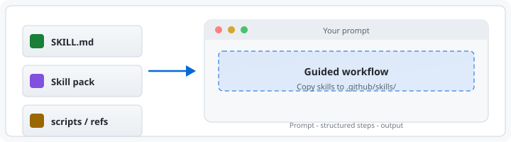

# Agent Skills

[](LICENSE)
[](https://github.com/dneprokos/agent-skills/stargazers)

Reusable agent skills you can copy into `.github/skills/`, `.cursor/skills/`, or `.claude/skills/` and adapt for your own repositories. The repo contains workflows, supporting templates, and helper scripts — no build system or package manager required.



## Overview

Each skill targets a specific workflow and is activated by natural-language prompts:

| Skill                                                                                    | Purpose                                                                                                                                              | Contents                                 |
| ---------------------------------------------------------------------------------------- | ---------------------------------------------------------------------------------------------------------------------------------------------------- | ---------------------------------------- |
| [`agentic-workflow-review`](.github/skills/agentic-workflow-review/)                     | Critiques a skill, orchestrator, or agent set as an architect: score, maturity level, Keep/Remove/Merge/Split verdicts, approve or reject decision | `SKILL.md`, references                   |
| [`api-test-scenario-rtm-backfill`](.github/skills/api-test-scenario-rtm-backfill/)       | Bootstraps an API Test Scenario RTM from existing API tests when no RTM file exists yet                                                              | `SKILL.md`, README, references, templates |
| [`api-test-scenario-rtm-generator`](.github/skills/api-test-scenario-rtm-generator/)     | Generates an API Test Scenario RTM (Requirements Traceability Matrix) with boundary and validation coverage from a prompt, OpenAPI spec, or controller | `SKILL.md`, README, config, references, templates |
| [`api-test-scenario-rtm-updater`](.github/skills/api-test-scenario-rtm-updater/)         | Reviews, syncs, and updates existing API Test Scenario RTM files after tests or coverage standards change                                            | `SKILL.md`                               |
| [`bug-report-formatter`](.github/skills/bug-report-formatter/)                           | Converts messy bug descriptions, stack traces, or error logs into a structured Jira-ready report; optionally creates a Jira ticket via Atlassian MCP | `SKILL.md`                               |
| [`dneprokos-medium-article-reviewer`](.github/skills/dneprokos-medium-article-reviewer/) | Section-by-section critique of a Medium article with actionable suggestions based on the author's established style                                  | `SKILL.md`, references                   |
| [`educational-resource-searcher`](.github/skills/educational-resource-searcher/)         | Finds top-rated tutorials, courses, and videos on any topic across YouTube, Udemy, Coursera, Pluralsight, and more                                   | `SKILL.md`                               |
| [`git-branch-creator`](.github/skills/git-branch-creator/)                               | Creates a new Git branch after verifying that `main` is ready and up to date                                                                         | `SKILL.md`, README, script               |
| [`git-commit-creator`](.github/skills/git-commit-creator/)                               | Creates a Conventional Commits message from staged changes                                                                                           | `SKILL.md`, README, references, script   |
| [`git-pr-creator`](.github/skills/git-pr-creator/)                                       | Creates a pull request from the current branch with ticket-style PR titles                                                                           | `SKILL.md`, README, references, script   |
| [`git-push-creator`](.github/skills/git-push-creator/)                                   | Pushes the current local branch to `origin`                                                                                                          | `SKILL.md`, README, script               |
| [`git-workflow-orchestrator`](.github/skills/git-workflow-orchestrator/)                 | Phased branch → commit → push → PR with per-phase status and PR URL                                                                                  | `SKILL.md`, script                       |
| [`grill-me`](.github/skills/grill-me/)                                                   | User-invoked relentless interview that sharpens a plan or design (wraps `grilling`)                                                                  | `SKILL.md`                               |
| [`grilling`](.github/skills/grilling/)                                                   | Stress-tests a plan, decision, or idea with one hard question at a time                                                                              | `SKILL.md`                               |
| [`jira-bug-creator`](.github/skills/jira-bug-creator/)                                   | Files a well-formed Jira bug from a failed Playwright test, a defect finding, or a description: draft scripts, duplicate check, preview, create     | `SKILL.md`, config, assets, references, scripts |
| [`jira-issue-creator`](.github/skills/jira-issue-creator/)                               | Creates Jira Cloud issues (bugs, tasks, stories, sub-tasks) via Atlassian MCP using local project defaults                                           | `SKILL.md`, README, config, references, templates |
| [`jira-issue-searcher`](.github/skills/jira-issue-searcher/)                             | Runs JQL queries and backlog, sprint, and bug lists against Jira Cloud via Atlassian MCP                                                             | `SKILL.md`, README, config, references   |
| [`jira-issue-updater`](.github/skills/jira-issue-updater/)                               | Transitions statuses, adds comments, edits fields, and links Jira Cloud issues via Atlassian MCP                                                     | `SKILL.md`, README, config, references, templates |
| [`jira-metrics-bug-leakage`](.github/skills/jira-metrics-bug-leakage/)                   | Measures defect leakage from Jira (bugs found in production vs before release) and builds a report and shareable dashboard                           | `SKILL.md`, config, assets, references, scripts |
| [`jira-story-reviewer`](.github/skills/jira-story-reviewer/)                             | Fetches a Jira story via Atlassian MCP and grades it against the 8 characteristics of good requirements                                              | `SKILL.md`                               |
| [`meeting-notes-summarizer`](.github/skills/meeting-notes-summarizer/)                   | Turns transcripts or messy notes into a Teams/email-ready structured recap                                                                           | `SKILL.md`, references                   |
| [`owasp-security-check`](.github/skills/owasp-security-check/)                           | Security audit guidelines for web applications and REST APIs based on the OWASP Top 10                                                               | `SKILL.md`, references                   |
| [`readme-polisher`](.github/skills/readme-polisher/)                                     | Drafts or upgrades a repository `README.md` using real project evidence                                                                              | `SKILL.md`, references, assets, script   |
| [`requirements-reviewer`](.github/skills/requirements-reviewer/)                         | Reviews requirements against 8 quality characteristics (clear, complete, consistent…) and produces a graded report                                   | `SKILL.md`, references                   |
| [`rest-api-design`](.github/skills/rest-api-design/)                                     | Designs and reviews REST APIs: paths, HTTP semantics, pagination, versioning, errors, OpenAPI                                                        | `SKILL.md`, README, references           |
| [`skill-copier`](.github/skills/skill-copier/)                                           | Copies or syncs skills between `.claude/skills/`, `.cursor/skills/`, and `.github/skills/`                                                           | `SKILL.md`, script                       |
| [`skill-creator`](.github/skills/skill-creator/)                                         | Creates, tests, and iteratively improves agent skills with eval runs and a results viewer                                                            | `SKILL.md`, agents, scripts, eval-viewer |
| [`skill-validator`](.github/skills/skill-validator/)                                     | Security and structural validation of workspace skills with a per-skill risk table                                                                   | `SKILL.md`                               |
| [`slack-markdown-generator`](.github/skills/slack-markdown-generator/)                   | Converts any content into a Slack Block Kit JSON payload, handling the 12k-char limit and Slack-specific quirks                                      | `SKILL.md`                               |
| [`token-usage-reporting`](.github/skills/token-usage-reporting/)                         | Produces day/week/month token usage reports in table format                                                                                          | `SKILL.md`, config, template, script     |
| [`ut-analyst`](.github/skills/ut-analyst/)                                               | **Phase 1** — classifies dependencies, detects non-determinism, enumerates test cases using EP/BVA/DT/ST, produces JSON test plan                    | `SKILL.md`, README, references, evals    |
| [`ut-architect`](.github/skills/ut-architect/)                                           | **Phase 2** — assigns mock/real strategy per dependency, resolves assertion style, specifies non-determinism abstractions                            | `SKILL.md`, README, references, evals    |
| [`ut-coder`](.github/skills/ut-coder/)                                                   | **Phase 3** — generates the complete, compilable test file: AAA pattern, parameterized tests, mocks, null-guards, setup/teardown                     | `SKILL.md`, README, references, evals    |
| [`web-user-guide`](.github/skills/web-user-guide/)                                       | Writes an end-user guide with screenshots by driving the real page through `playwright-cli`                                                          | `SKILL.md`, references, scripts          |
| [`windows-secretmanagement-setup`](.github/skills/windows-secretmanagement-setup/)       | Installs and configures Windows SecretManagement + SecretStore for PowerShell credential storage (bootstraps `GitHubToken` for PR skills)            | `SKILL.md`                               |

## Unit Test Generator Agent

The three `ut-*` skills are coordinated by a dedicated agent: [`.github/agents/unit-test-generator.agent.md`](.github/agents/unit-test-generator.agent.md).

The agent enforces a strict **Analyst → Architect → Coder** pipeline where responsibilities are never combined across phases:

```
Source class
     │
     ▼
Phase 1 — Analyst    → JSON test plan  (dependencies, test cases, null-guards, non-determinism)
     │
     ▼
Phase 2 — Architect  → Strategy summary (mock/real assignments, assertion style, abstractions)
     │
     ▼
Phase 3 — Coder      → Complete, compilable test file
```

**Usage:** Open a source file in the editor, then invoke the agent:

```text
@unit-test-generator generate tests for MyService
@unit-test-generator generate tests for the open file, skipReview: true
```

Each skill can also be used **standalone** via slash commands (`/ut-analyst`, `/ut-architect`, `/ut-coder`) when you want to run only one phase or inspect intermediate outputs.

## Claude Code Reference Set: Sub-Agents, Hooks, Plugin

These pieces come from the conference project [`suvore-qa-confa-test-automation`](https://github.com/dneprokos/suvore-qa-confa-test-automation). They use Claude Code features (sub-agents, hooks, plugins), so they live under `.claude/` and `plugins/` only and are not mirrored to `.github/` or `.cursor/`.

| Piece | Where | What it shows |
| --- | --- | --- |
| QA workflow pipeline | [`.claude/skills/qa-workflow/`](.claude/skills/qa-workflow/), [`.claude/skills/qa-ship-tests/`](.claude/skills/qa-ship-tests/), `.claude/agents/qa-*.md`, `.claude/agents/aqa-*.md` | Orchestrator skill driving nine sub-agents from a Jira ticket to requirements, test design, Playwright API and UI tests, reviews, and a pull request |
| Pipeline contracts | [`docs/automation/`](docs/automation/), [`scripts/`](scripts/) | Spec etalons, verdict and revision contracts, plus the state, lint, and API-surface scripts the agents call |
| Concept and sample run | [`docs/conference/`](docs/conference/) | Why the workflow is shaped this way, diagrams, and a real run report with per-agent cost |
| `git-change-analyst` | [`.claude/agents/git-change-analyst.md`](.claude/agents/git-change-analyst.md) | Haiku sub-agent that reads the working tree and proposes a Conventional Commits message |
| Hooks | [`.claude/hooks/`](.claude/hooks/) | `agent-metrics` (records every sub-agent run and its token cost), `metrics-report`, `prompted-by`, `codex-review` |
| `slack-bug-triage` plugin | [`plugins/slack-bug-triage/`](plugins/slack-bug-triage/), [`.claude-plugin/marketplace.json`](.claude-plugin/marketplace.json) | Skill, five `triage-*` sub-agents, and journal scripts packaged as an installable plugin |

Things to know before using them:

- **The QA pipeline is reference material here.** Its agents write Playwright tests against the conference project's suite (`tests/`, `pages/`, `fixtures/`), which is not part of this repository. Read it for the orchestration pattern; run it from the source project.
- **Jira values are the demo project's.** `jira-bug-creator`, `jira-metrics-bug-leakage`, and the plugin read site, `cloudId`, project key (`SCRUM`), and custom field ids from their `config.json`. Change those before pointing them at your own Jira.
- **Only `agent-metrics` is wired** in `.claude/settings.json`; it writes to the gitignored `.workflow/metrics/`. `prompted-by` and `codex-review` are Stop-hook examples to wire yourself (`codex-review` needs the Codex CLI).
- **Script tests** run with Node, no install needed: `node --test "scripts/__tests__/*.test.mjs"`. One `spec-lint` test fails here because it lints the source project's own specs.

Install the plugin from this repository:

```text
/plugin marketplace add dneprokos/agent-skills
/plugin install slack-bug-triage@agent-skills
```

## Getting Started

1. Clone this repository and open it in VS Code or Cursor.
2. Browse the skill folders under `.github/skills/`.
3. Copy the skill you want into your own project's `.github/skills/` (Copilot), `.cursor/skills/` (Cursor), or `.claude/skills/` (Claude Code) directory.
4. Prompt the agent with a request that matches the skill's domain.

### Clone locally

```bash
git clone https://github.com/dneprokos/agent-skills.git
cd agent-skills
```

### Example prompts

```text
Improve this repository README using the readme-polisher skill.
Generate API test scenarios for POST /api/users.
Review these REST endpoints using the rest-api-design skill (paste OpenAPI or routes).
@unit-test-generator generate tests for MyService
@unit-test-generator generate tests for the open file, skipReview: true
/ut-analyst analyze MyService
/ut-architect [paste Analyst JSON]
/ut-coder [paste Analyst JSON and Architect strategy]
Create a new branch named feature/add-login-flow.
Commit the current branch using the git-commit-creator skill.
Push the current branch using the git-push-creator skill.
Create a pull request from this branch using the git-pr-creator skill.
Run the git-workflow-orchestrator to ship my branch (branch, commit, push, PR).
Create a token usage report for this week.
Summarize these meeting notes using the meeting-notes-summarizer skill (paste notes below).
List Jira backlog issues for project SCRUM using the jira-issue-searcher skill.
Copy skills from .github to .claude using the skill-copier skill.
Help me draft and evaluate a new agent skill using the skill-creator skill.
Format this bug report for Jira.
Review my requirements document.
Find top Python courses on Udemy.
Format this status update for Slack.
```

> Exact invocation style varies by tool surface (Copilot, Cursor, Claude Code), but natural-language prompts work well across all of them.

## Skill Mirrors

This repository maintains the same skill set under three locations:

| Location          | Tool                              |
| ----------------- | --------------------------------- |
| `.github/skills/` | GitHub Copilot (canonical source) |
| `.cursor/skills/` | Cursor Agent Skills               |
| `.claude/skills/` | Claude Code                       |

**Keep all three in sync when you add or modify a skill.** Use the [`skill-copier`](.github/skills/skill-copier/) skill to copy skills between folders automatically:

```text
Copy skills from .github to .claude
Copy skills from .github to .cursor, overwrite existing
```

The `skill-copier` skill runs `.github/skills/skill-copier/scripts/Copy-Skills.ps1` under the hood and reports how many were copied, skipped, or failed.

Known gaps in the Cursor and Claude mirrors:

- **`brainstorming`, `unit-test-generator`, `qa-workflow`, `qa-ship-tests`** — exist only in `.claude/skills/` (Claude Code specific).
- **`hello-world`** — exists only in `.cursor/skills/`.
- **`jira-story-reviewer`** — the `.claude/skills/` copy adds a `model:` frontmatter key; keep it when re-syncing.

Shared reference files (`project-patterns.md`, `analyst-test-plan-schema.md`) are replicated across skill folders. Each copy includes a **Sync** callout — update all copies together.

## Jira Skills and Atlassian MCP

Jira work is split across focused skills, each talking to Jira Cloud through the Atlassian MCP:

- [`jira-issue-searcher`](.github/skills/jira-issue-searcher/) — read-only: JQL queries, backlogs, sprint scope, bug lists.
- [`jira-issue-creator`](.github/skills/jira-issue-creator/) — creates bugs, tasks, stories, and sub-tasks.
- [`jira-issue-updater`](.github/skills/jira-issue-updater/) — transitions, comments, field edits, and issue links.
- [`jira-story-reviewer`](.github/skills/jira-story-reviewer/) — fetches a story by key and reviews it as a requirement.
- [`bug-report-formatter`](.github/skills/bug-report-formatter/) — formats a bug report and can optionally file it as a Jira Bug.

You still need to connect Cursor (or another client) to the [Atlassian Rovo MCP Server](https://support.atlassian.com/rovo/docs/setting-up-ides/) and authenticate (OAuth or API token).

The creator, searcher, and updater skills read project defaults from `config/jira-defaults.local.json` in their own folder. Copy `config/jira-defaults.local.example.json` to create it; the `.local.json` file is gitignored.

## Token Prediction Demo

[`token_prediction_example.py`](token_prediction_example.py) is a small standalone script that demonstrates how a language model predicts tokens one at a time. It streams Claude's response and prints each token delta as it arrives — a concrete illustration of how the model builds output incrementally rather than "thinking" the full answer first.

### Setup

```bash
pip install anthropic python-dotenv
cp .env.example .env
# open .env and fill in your ANTHROPIC_API_KEY
```

Get an API key at [console.anthropic.com](https://console.anthropic.com) → **API Keys**.

> `.env` is listed in `.gitignore` — it will not be committed.

### Run

```bash
python token_prediction_example.py
```

The script opens an interactive REPL. Type any prompt and press Enter to watch Claude predict tokens live. Each printed chunk is one streaming delta from the API. The session ends with a summary of streaming deltas received, output tokens (as counted by the API), input tokens, elapsed time, and approximate tokens per second.

```
You: Explain recursion in one sentence.

Tokens arriving (each character group is one predicted token):

Recursion is a programming technique where a function calls itself...

============================================================
Streaming deltas received : 32
Output tokens (API count) : 28
Input tokens              : 15
Wall-clock time           : 1.43s
Approx tokens/sec         : 19.6
```

Type `quit` or press Ctrl+C to exit.

## Typical Skill Layout

```text
.github/skills/{skill-name}/
├── SKILL.md          # required — agent instructions and YAML frontmatter
├── README.md         # optional — human-facing summary and example prompts
├── config/           # optional — configuration files
├── scripts/          # optional — PowerShell helper scripts
├── templates/        # optional — output templates
└── references/       # optional — supporting guidance files
```

## Repository Map

```text
agent-skills/
├── docs/
│   ├── assets/
│   │   └── skills-hero.svg
│   ├── automation/            # QA pipeline contracts, etalons, references
│   └── conference/            # QA pipeline concept doc and sample run report
├── .github/
│   ├── agents/
│   │   └── unit-test-generator.agent.md  # Orchestrates the ut-* pipeline
│   └── skills/                # Canonical skills
│       ├── agentic-workflow-review/
│       ├── api-test-scenario-rtm-backfill/
│       ├── api-test-scenario-rtm-generator/
│       ├── api-test-scenario-rtm-updater/
│       ├── bug-report-formatter/
│       ├── dneprokos-medium-article-reviewer/
│       ├── educational-resource-searcher/
│       ├── git-branch-creator/
│       ├── git-commit-creator/
│       ├── git-pr-creator/
│       ├── git-push-creator/
│       ├── git-workflow-orchestrator/
│       ├── grill-me/
│       ├── grilling/
│       ├── jira-bug-creator/
│       ├── jira-issue-creator/
│       ├── jira-issue-searcher/
│       ├── jira-issue-updater/
│       ├── jira-metrics-bug-leakage/
│       ├── jira-story-reviewer/
│       ├── meeting-notes-summarizer/
│       ├── owasp-security-check/
│       ├── readme-polisher/
│       ├── requirements-reviewer/
│       ├── rest-api-design/
│       ├── skill-copier/
│       ├── skill-creator/
│       ├── skill-validator/
│       ├── slack-markdown-generator/
│       ├── token-usage-reporting/
│       ├── ut-analyst/     # Phase 1: dependency analysis + test plan
│       ├── ut-architect/   # Phase 2: mocking strategy + structure
│       ├── ut-coder/       # Phase 3: test file generation
│       ├── web-user-guide/
│       └── windows-secretmanagement-setup/
├── .cursor/
│   └── skills/                # Cursor Agent Skills mirror
├── .claude/
│   ├── agents/                # Sub-agents: ut-*, qa-*, aqa-*, git-change-analyst
│   ├── hooks/                 # agent-metrics, metrics-report, prompted-by, codex-review
│   ├── settings.json          # Permissions, hooks wiring (blocks .env reads)
│   └── skills/                # Claude Code mirror, plus qa-workflow, qa-ship-tests
├── .claude-plugin/
│   └── marketplace.json       # Makes this repo a plugin marketplace
├── plugins/
│   └── slack-bug-triage/      # Skill + triage-* sub-agents + scripts
├── scripts/                   # QA pipeline state, lint, API-surface scripts and tests
├── token_prediction_example.py  # Streaming token prediction demo
├── .env.example               # Template for ANTHROPIC_API_KEY
├── README.md
└── LICENSE
```

## Contributing

Contributions are welcome. If you add a new skill:

1. Create `.github/skills/{skill-name}/SKILL.md` with correct YAML frontmatter.
2. Mirror the folder to `.cursor/skills/{skill-name}/` and `.claude/skills/{skill-name}/`.
3. Keep the skill focused on one workflow domain.
4. If the skill coordinates other skills, create an agent under `.github/agents/` instead.

test

## License

Released under the MIT License. See [`LICENSE`](LICENSE) for details.
------------
Something was added for testing. 
